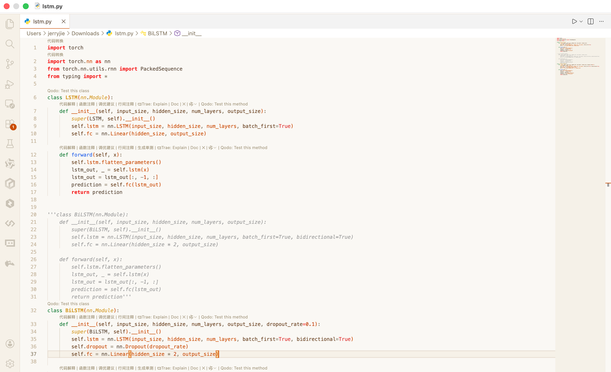

# Warm Orange Theme / 温暖橙色主题

**Language / 语言**: [English](#english) | [中文](#中文)

---

# English

A warm and cozy orange theme designed for long coding sessions, making your development environment more comfortable and inviting.

## Features

- **Warm Color Palette**: Soft amber orange paired with beige backgrounds
- **Eye-Friendly Design**: Low-saturation color scheme reduces eye strain
- **Complete Coverage**: Covers all IDE interface elements
- **Semantic Highlighting**: Intelligent code syntax highlighting

## Color Palette

| Color | Value |
|-------|-------|
| Primary Orange | `#c94c00` |
| Editor Background | `#faf8f3` |
| Text | `#5c4a3a` |

## Feedback

If you encounter any issues or have suggestions, please submit an issue:

**GitHub**: [https://github.com/jerryjie/trae-warm-orange-theme/issues](https://github.com/jerryjie/trae-warm-orange-theme/issues)

## License

MIT License

---

[↑ Back to Top / 返回顶部](#warm-orange-theme--温暖橙色主题) | [中文](#中文)

---

# 中文

一个温暖柔和的橙色主题，专为长时间编码设计，让你的开发环境更加舒适温馨。

## 主题特点

- **温暖配色**：柔和的琥珀橙搭配米白色背景
- **护眼设计**：低饱和度配色，减少眼睛疲劳
- **完整覆盖**：涵盖IDE所有界面元素
- **语义高亮**：智能的代码语法高亮

## 配色方案

| 颜色 | 值 |
|------|-----|
| 主橙色 | `#c94c00` |
| 编辑器背景 | `#faf8f3` |
| 文字 | `#5c4a3a` |

## 问题反馈

如果发现问题或有改进建议，请提交 Issue：

**GitHub**: [https://github.com/jerryjie/trae-warm-orange-theme/issues](https://github.com/jerryjie/trae-warm-orange-theme/issues)

## 许可证

MIT License

---

[↑ Back to Top / 返回顶部](#warm-orange-theme--温暖橙色主题) | [English](#english)

